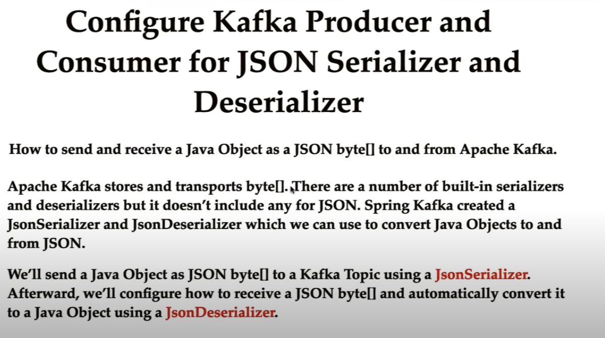

# Spring-boot and Apache Kafka Tutorial

1. 
2. 
3. 
4. 
5. 
6. 
7. 
8. 

# Running the Spring boot and Kakfa set up
**You should have java8+ and either maven or gradle installed for building teh project
1. Please visit https://start.spring.io/
2. Use [this](https://stream.wikimedia.org/v2/stream/recentchange) for real world wikimedia project,
3. 

# Installation of Apache kafka
**You should have Java8+ and optionally gradle (latest version) already installed on your computer**
1. Please visit https://kafka.apache.org/downloads,
2. Choose the binary that is suitable to you,
3. On mac, use .tgz file to download
4. Once downloaded the tgz file, let's say in "Downloads" folder,
5. Create a folder "kafka",
6. then use below command to untar the contents, `tar -xvzf ~/Downloads/kafka-3.7.0-src.tgz --strip 1 `
7. --strip is for the default top level folder to be ignored and all the tar file contents be in kafka folder,
8. then run below commands in sequence  
   8.1 `sh bin/zookeeper-server-start.sh config/zookeeper.properties`  
   8.2 `sh bin/kafka-server-start.sh config/server.properties`   
   -- Open Another Window  
   8.3 `bin/kafka-topics.sh --bootstrap-server localhost:9092 --list`  
   8.4 `bin/kafka-topics.sh --bootstrap-server localhost:9092 --topic first_topic --create --partitions 3 --replication-factor 1`  
   8.5 `bin/kafka-console-producer.sh --bootstrap-server localhost:9092 --topic first_topic`  (**This will bring you to prompt..so wait to send the first message**)
   -- Open Another window  
   8.6 `bin/kafka-console-consumer.sh --bootstrap-server localhost:9092 --topic first_topic --from-beginning` 
   8.7. now send the message like 'Hello world' (without quotes) `>` prompt from 8.5 and switch to console consumer window, you should see the message that you sent from producer window is consumed and displayed for you
9. Send few more messages and if you should be able to see them on console consumer window,
10. You All SET with running kafka on local machine...**Congratulations !!!**